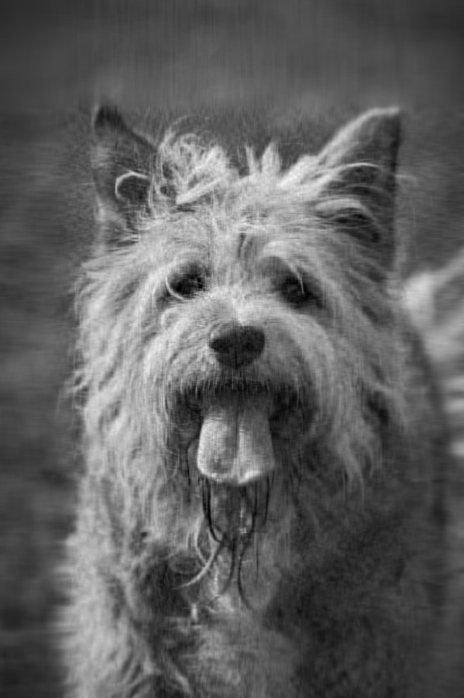

# Image Compression Using SVD


This project was built by applying concepts from **Mathematics III (Semester 3)**, especially linear algebra and SVD, to a practical image-processing workflow.

## Quick Overview

- Converts an input image to grayscale matrix form
- Performs SVD with NumPy and keeps top $k$ singular components
- Reconstructs a low-rank approximation of the image
- Compresses reconstructed output using selectable codecs (JPEG/WebP/PNG)
- Exports an additional compressed `.npz` file with SVD factors ($U_k,\Sigma_k,V_k^T$)
- Reports theoretical matrix ratio and real on-disk savings separately
- Includes a pastel-themed web UI to upload images and preview SVD output

## Mathematics Behind the Project

An image matrix $A \in \mathbb{R}^{m \times n}$ is decomposed as:

$$
A = U\Sigma V^T
$$

Using only top $k$ singular values gives:

$$
A_k = U_k\Sigma_kV_k^T
$$

This low-rank approximation reduces information while preserving major visual structure.

## Academic Context (Mathematics III, Semester 3)

This implementation directly uses topics taught in Mathematics III:

- Matrix representation of signals/images
- Orthogonality and basis transformation
- Singular values and rank
- Low-rank approximation as a compression strategy

This project is a practical demonstration of how classroom linear algebra translates into engineering applications.

## Result Screenshots

### Input and Outputs

| Original Input | SVD Output (PNG, k=50) | SVD Output (JPEG, k=50) |
|---|---|---|
|  |  |  |


## Why a "Compressed" File Can Still Be Larger

This is one of the key takeaways of the project:

- The printed SVD compression ratio refers to storing factors $U_k$, $\Sigma_k$, $V_k^T$.
- Saved image files are encoded by formats like PNG/JPEG, which follow different compression rules.
- PNG is lossless and may become larger if reconstructed textures/noise are harder to encode.
- JPEG is lossy and often remains smaller for natural images.

So mathematical compression and on-disk file size are related but not equivalent.

## Web App Compression Behavior

The web UI now provides two independent compression artifacts per run:

- Compressed image file: encoded as JPEG/WebP/PNG based on your selection
- SVD factor archive: `.npz` package containing $U_k$, singular values, and $V_k^T$

This means you can compare:

- Practical file compression for viewing/sharing (image codec)
- Compact mathematical representation for reconstruction experiments (`.npz`)

For most natural photos, JPEG/WebP gives real file-size reduction at moderate quality settings.

## Current Sample Output (k = 50)

From a sample run:

- Theoretical SVD ratio: **16.7%**
- Original (`input.jpg`): **63.2 KB**
- Reconstructed PNG (`examples/outputs/compressed_k50.png`): **193.0 KB** (305.2% of original)
- Reconstructed JPEG (`examples/outputs/compressed_k50.jpg`): **70.8 KB** (111.9% of original)

## Tech Stack

- Python 3
- NumPy
- Matplotlib
- Pillow

## Project Structure

```text
svd-compress/
|- app.py
|- svd_compression.py
|- examples/
|  |- outputs/
|     |- compressed_k50.png
|     |- compressed_k50.jpg
|- docs/
|  |- screenshots/
|     |- input.jpg
|     |- compressed_k50.png
|     |- compressed_k50.jpg
|- web/
|  |- templates/
|  |  |- index.html
|  |- static/
|     |- css/
|     |  |- styles.css
|     |- js/
|        |- ui.js
|- input.jpg
|- requirements.txt
|- README.md
|- LICENSE
|- .gitignore
```

## Setup

Install dependencies:

```bash
pip install -r requirements.txt
```

## Run (Web UI)

```bash
python3 app.py
```

Then open:

```text
http://127.0.0.1:5000/
```

If using local virtual environment:

```bash
./venv/bin/python app.py
```

## Run (CLI Script)

```bash
python3 svd_compression.py
```

If using local virtual environment:

```bash
./venv/bin/python svd_compression.py
```

## Script Workflow

1. Read `input.jpg`
2. Convert to grayscale
3. Set `k = 50`
4. Compute SVD and reconstruct image using top-$k$ components
5. Clip values to valid pixel range
6. Display original and reconstructed image
7. Print theoretical SVD compression ratio
8. Save reconstructed image as PNG, JPEG, and WebP
9. Save SVD factors as compressed `.npz`
10. Print practical disk-size report

## Limitations

- Grayscale pipeline only
- Single fixed value of `k` in code
- No quality metric (PSNR/SSIM) yet
- `.npz` is for scientific storage/reconstruction, not direct browser display

## Author

**Elias Joby**  
CSE, NIT Calicut (NITC)
