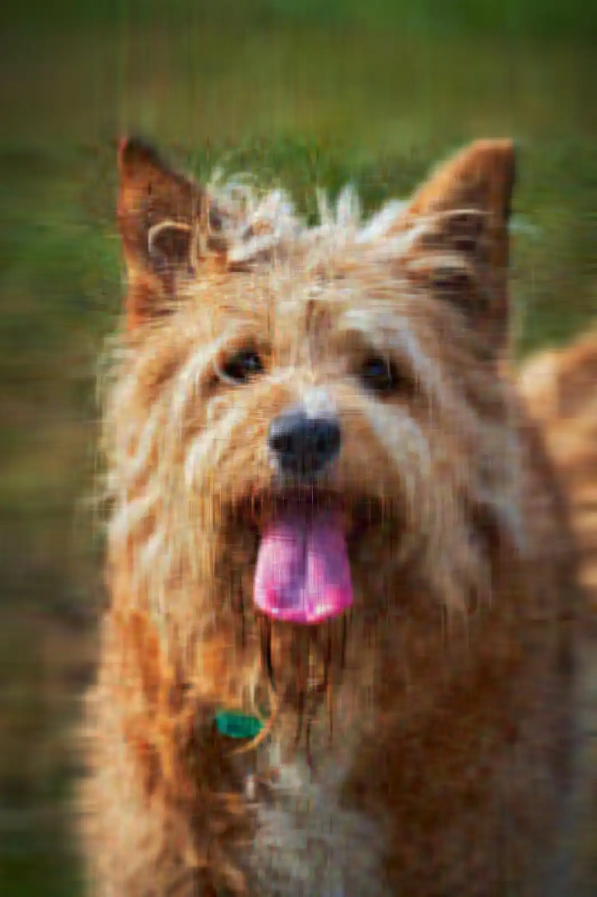

# Image Compression Using SVD


This project was built by applying concepts from **Mathematics III (Semester 3)**, especially linear algebra and SVD, to a practical image-processing workflow.

## Quick Overview

- Converts an input image to RGB matrix form
- Performs SVD with NumPy and keeps top $k$ singular components
- Reconstructs a low-rank approximation while preserving color channels
- Produces real compressed image files with selectable PNG, JPEG, or WebP output
- Produces a compressed NPZ artifact containing SVD factors per channel
- Reports actual byte-size deltas for both image output and NPZ output
- Includes a pastel-themed web UI to upload images and preview SVD output

## Mathematics Behind the Project

For each RGB channel, an image matrix $A_c \in \mathbb{R}^{m \times n}$ is decomposed as:

$$
A_c = U_c\Sigma_c V_c^T
$$

Using only top $k$ singular values per channel gives:

$$
A_{c,k} = U_{c,k}\Sigma_{c,k}V_{c,k}^T
$$

This low-rank approximation reduces information while preserving major visual structure.

## Academic Context (Mathematics III, Semester 3)

This implementation directly uses topics taught in Mathematics III:

- Matrix representation of signals/images
- Orthogonality and basis transformation
- Singular values and rank
- Low-rank approximation as a compression strategy

This project is a practical demonstration of how classroom linear algebra translates into engineering applications.

## Result Screenshots

### Input and Outputs (Generated from input.jpg)

| Original Input | Compressed (WEBP, k=30, q=55) | Compressed (JPEG, k=50, q=75) |
|---|---|---|
|  |  |  |

### Size Comparison for the Above Images

| Variant | File | Size |
|---|---|---|
| Original | `input.jpg` | **98.2 KB** |
| Compressed WEBP (k=30, q=55) | `examples/outputs/compressed_k30.webp` | **38.9 KB** (39.7% of original) |
| Compressed JPEG (k=50, q=75) | `examples/outputs/compressed_k50.jpg` | **124.5 KB** (126.8% of original) |


## Why a "Compressed" File Can Still Be Larger

This is one of the key takeaways of the project:

- The printed SVD compression ratio refers to storing factors $U_k$, $\Sigma_k$, $V_k^T$.
- Saved image files are encoded by formats like PNG/JPEG, which follow different compression rules.
- PNG is lossless and may become larger if reconstructed textures/noise are harder to encode.
- JPEG is lossy and often remains smaller for natural images.

So mathematical compression and on-disk file size are related but not equivalent.

## Current Sample Output (input.jpg)

From recent command runs:

- Run A: `python3 svd_compression.py --input input.jpg --k 50 --format JPEG --quality 75 --no-plot`
	Original (`input.jpg`): **98.2 KB**
	Output (`examples/outputs/compressed_k50.jpg`): **124.5 KB** (126.8% of original)
- Run B: `python3 svd_compression.py --input input.jpg --k 30 --format WEBP --quality 55 --no-plot`
	Original (`input.jpg`): **98.2 KB**
	Output (`examples/outputs/compressed_k30.webp`): **38.9 KB** (39.7% of original)

In the web UI, you can now choose output codec and quality to get practical on-disk compression.
You can also download SVD factors as NPZ, which represents matrix-factor compression directly.

## Tech Stack

- Python 3
- NumPy
- Matplotlib
- Pillow

## Project Structure

```text
svd-compress/
|- app.py
|- svd_compression.py
|- examples/
|  |- outputs/
|     |- compressed_k30.webp
|     |- compressed_k50.png
|     |- compressed_k50.jpg
|     |- compressed_k50.webp
|     |- compressed_factors_k30.npz
|     |- compressed_factors_k50.npz
|- web/
|  |- templates/
|  |  |- index.html
|  |- static/
|     |- css/
|     |  |- styles.css
|     |- js/
|        |- ui.js
|- input.jpg
|- requirements.txt
|- README.md
|- LICENSE
|- .gitignore
```

## Setup

Install dependencies:

```bash
pip install -r requirements.txt
```

## Run (Web UI)

```bash
python3 app.py
```

Then open:

```text
http://127.0.0.1:5000/
```

If using local virtual environment:

```bash
./venv/bin/python app.py
```

## Run (CLI Script)

```bash
python3 svd_compression.py
```

If using local virtual environment:

```bash
./venv/bin/python svd_compression.py
```

## Script Workflow

1. Read `input.jpg`
2. Convert to RGB
3. Set `k` and choose output format and quality
4. Compute SVD and reconstruct image using top-$k$ components
5. Clip values to valid pixel range
6. Display original and reconstructed image (unless `--no-plot` is used)
7. Print theoretical SVD compression ratio
8. Save reconstructed image in selected format
9. Save SVD factors as compressed NPZ
10. Print practical disk-size report

### CLI Example

```bash
python3 svd_compression.py --input input.jpg --k 30 --format WEBP --quality 55 --no-plot
```

## Limitations

- Large images can produce very large NPZ factor files
- No quality metric (PSNR/SSIM) yet

## Author

**Elias Joby**  
CSE, NIT Calicut (NITC)
